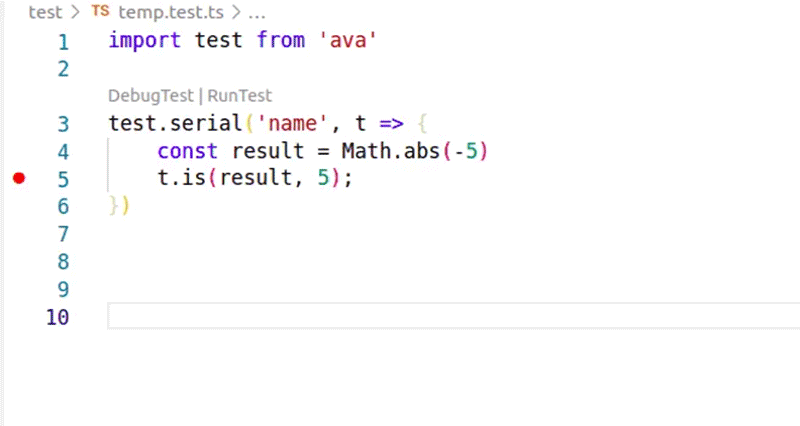

# ava-launch

Debug and run single AVA (<https://github.com/avajs/ava>) tests easily using multiple npm scripts. Supports both unit and integration tests.



## Why

The combination of a test runner and a debugger is phenomenal.  But with TS in particular it can be hard to get the VS Code debugger and AVA to cooperate.  This solution has a zero learning curve--just click to launch from within your code!

## Getting Started

### Launching Unit Tests

You should be able to debug or run from unit test files immediately. The only requirement is that you have the npm `test` script defined.

Of course, to get tests to run at all you may have to specify your AVA configuration within your project.  One simple way is within your `project.json` e.g.:

```json
  "ava": {
    "files": [
      "test/**/*.test.ts"
    ],
    "extensions": [
      "ts"
    ],
    "require": [
      "ts-node/register"
    ]
  }
```

### Integration and/or "Temp" Tests

To set up integration tests, follow these steps:

1. Create an npm script for running integration tests. You will probably need to have it call a designated config file, e.g.

    ```json
        "int-test": "ava --config int-tests.config.cjs",
    ```

2. Add the config file to your project root directory.  You may need a generous timeout. For instance, `int-tests.config.cjs` could look like this:

    ```cjs
    module.exports = {
    files: ['test/int/**/*.int.ts'],
    "extensions": [
        "ts"
    ],
    "require": [
        "ts-node/register"
    ],
    "timeout": "20m"
    };
    ```

3. In the [Extension Settings](#extension-settings), designate a unique file extension for integration tests and the name of the npm script:

    

After that, any time you click on `DebugTest`, `ava-launch` will run the correct script.  No need for setting up a launch configuration!

The same can be done for `temp` tests.

## Features

* CodeLens for `DebugTest` and `RunTest`.
* No learning curve.  No need to create a launch configuration.
* Adds any `.env` file variables to a launch.  That's important if you are using something like NPM_TOKEN to download a private file.
* Currently supports three types of tests:
  * unit (uses the npm `test` script)
  * integration
  * temp.

  A temp test is useful for a quick check on a portion of your code. [Note: the terms "integration" and "temp" do not inherently mean anything to `ava-launch`.  You can use them for any type of test that you require.]
* For the `integration` and `temp` types, you can specify in the `ava-launch` configuration an npm script and a file extension.  For instance, for integration tests, you can specify `int-test` as an npm script and `int.ts` as a file extension. You can then run whatever you'd like there.
* Click on Codelenses `DebugTest` to launch a debugger, and `RunTest` to run it.  The script to execute is determined from the extension of the active file.  If the active file extension is neither the one for `integration` nor `temp`, then the `test` script gets executed.

## Gotchas

If you get the AVA message `Couldn’t find any files to test`, that can mean one of two things:

1. The name of the file is not matched by the glob for your testing configuration.  For instance, if you configured AVA to expect `test/**/*.test.ts` and your file is not in the `test` directory or does not end with `.test.ts`, you will get this message.
2. It could also mean that your file has syntax errors.  If your project has linting set up, it should be possible to check for that.  One way is to click `RunTest`, which will run it in your VS code terminal, and then to run the last line with the `-m` flag removed.  

   For instance, here's what shows up in the console after calling `RunTest` with a file that has a syntax error:

   ```bash
    $ cd /home/yisroel/packages/neo-forgery-all/neo-forgery && npm run test -- /home/yisroel/packages/neo-forgery-all/neo-forgery/test/custom/conversions/liveToData.test.ts -m="liveToData"

    > neo-forgery@1.10.0 test
    > ava "/home/yisroel/packages/neo-forgery-all/neo-forgery/test/custom/conversions/liveToData.test.ts" "-m=liveToData"

      ✖ Couldn’t find any files to test
     ```

   Pushing the up arrow key and removing the `-m="liveToData"` lets you run it again and get a syntax error.
  
    ```bash
    $ cd /home/yisroel/packages/neo-forgery-all/neo-forgery && npm run test -- /home/yisroel/packages/neo-forgery-all/neo-forgery/test/custom/conversions/liveToData.test.ts

    > neo-forgery@1.10.0 test
    > ava "/home/yisroel/packages/neo-forgery-all/neo-forgery/test/custom/conversions/liveToData.test.ts"


      ✖ No tests found in test/custom/conversions/liveToData.test.ts

      ─

      Uncaught exception in test/custom/conversions/liveToData.test.ts

      test/custom/conversions/liveToData.test.ts(5,1): error TS2304: Cannot find name 'foo'.

      ─

      1 uncaught exception
      ```

Otherwise, the usage seems pretty simple.

## Extension Settings

### Integration Tests

* `ava-launch.integrationTestFileExtension`: extension for integration test files.
* `ava-launch.integrationTestFileScript`: npm script to run for integration tests. You can specify one that runs with a long timeout, and that only looks in certain paths.

### Temp Tests

* `ava-launch.tempTestFileExtension`:  extension for a temp test file.
* `ava-launch.tempTestFileScript`:  npm script to run for temp tests.  Works the same way as with the integration tests.

## Credit

This is based on the VSC extension [ava-test-runner](https://github.com/jacekczapiewski/vscode-ava-test-runner) created by ***jacekczapiewski***.  I fell in love with that extension, became its first reviewer with 5 stars, and in fact promoted it in two webinars on unit testing.

But I needed to run multiple types of tests, with a designated npm test for each type. The problem is that your unit test script should not run your integration scripts and vice versa. Also, I needed something with a pattern that matched more tests, and that incorporated env variables into runs.  

But I still think that his extension is nice, and his actually has some features that `ava-launch` doesn't have. Both can be run at the same time if you like.

## Known Issues

None so far, but the extension is new.

## Release Notes

### 1.0.0

Initial release.

